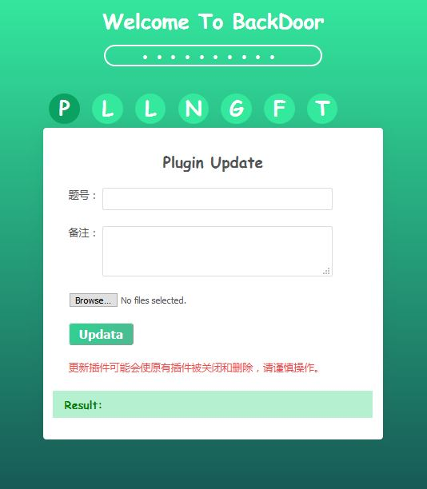
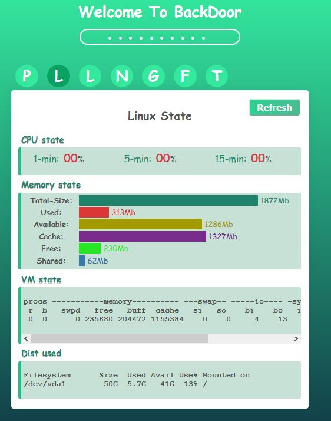
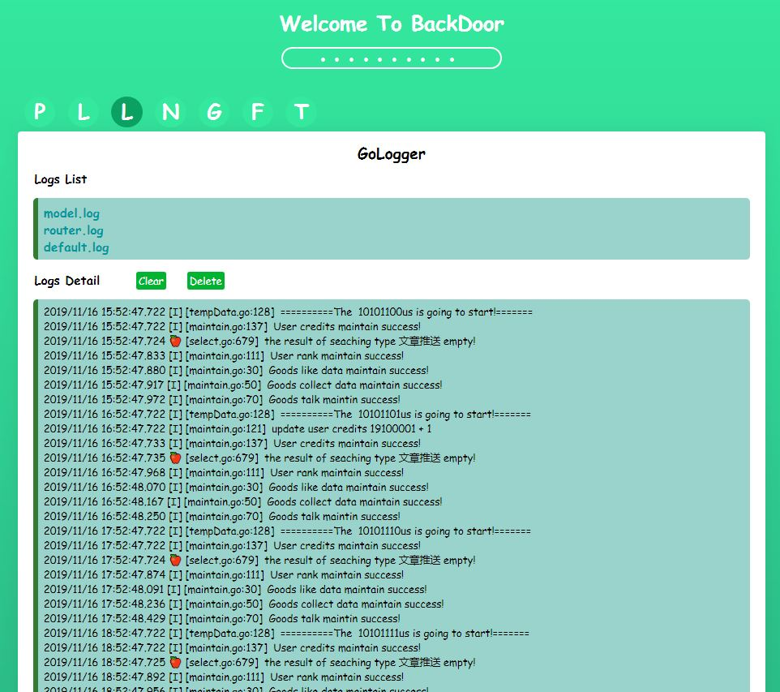
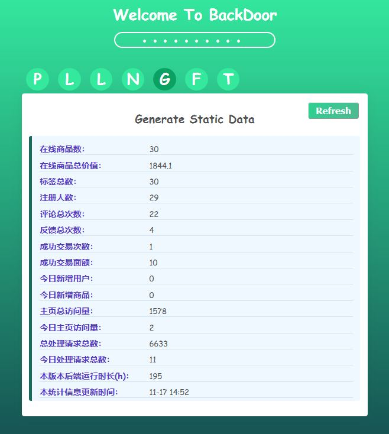
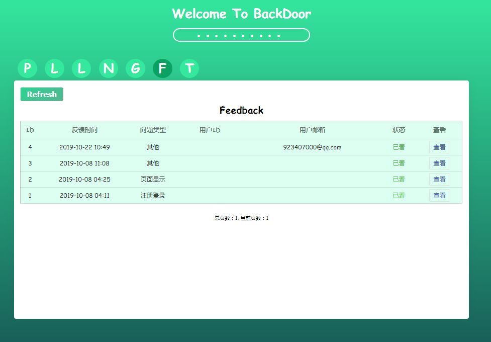

# Backdoor

## 简介：

这是一个简单的后台管理工具，主要用于司机俱乐部的后台管理。前端使用Angular，后端使用Go, 均原生实现，优点是轻便稳定，界面简洁，扩展容易。

暂时实现了以下功能：

1. 插件更新，文件上传。

2. 服务器状态图形化显示。

3. 日志显示。

4. 运营状况数据显示。

5. 反馈数据显示。

   

   

   

   

    

   

    

   

    

   